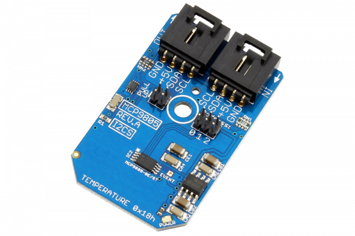

# MCP9805

The MCP9805 is a temperature sensor and a memory module designed to meet the JEDEC for Mobile Platform Memory Module Thermal Sensor.This device provides an accuracy of ±1°C from a temperature range of +75°C to +95°C. The MCP9805 comes with user-programmable registers that provide flexibility for dual in-line memory module (DIMM) temperature-sensing applications.
This Device is available from www.ncd.io 

[SKU: MCP9805_I2CS]

(https://store.ncd.io/product/mcp9805-memory-module-digital-temperature-sensor-%C2%B11c-at-75c-to-95c-i2c-mini-module/)
This Sample code can be used with Arduino.

Hardware needed to interface MCP9805 sensor with Arduino

1. <a href="https://store.ncd.io/product/i2c-shield-for-arduino-nano/">Arduino Nano</a>

2. <a href="https://store.ncd.io/product/i2c-shield-for-arduino-micro-with-i2c-expansion-port/">Arduino Micro</a>

3. <a href="https://store.ncd.io/product/i2c-shield-for-arduino-uno/">Arduino uno</a>

4. <a href="https://store.ncd.io/product/dual-i2c-shield-for-arduino-due-with-modular-communications-interface/">Arduino Due</a>

5. <a href="https://store.ncd.io/product/mcp9805-memory-module-digital-temperature-sensor-%C2%B11c-at-75c-to-95c-i2c-mini-module/">MCP9805 Memory module and Temperature Sensor</a>

6. <a href="https://store.ncd.io/product/i%C2%B2c-cable/">I2C Cable</a>

MCP9805:

The MCP9805 is a temperature sensor and a memory module designed to meet the JEDEC for Mobile Platform Memory Module Thermal Sensor.This device provides an accuracy of ±1°C from a temperature range of +75°C to +95°C. The MCP9805 comes with user-programmable registers that provide flexibility for dual in-line memory module (DIMM) temperature-sensing applications.

Applications:

• Dual In-line Memory Module (DIMM)

• Personal Computers (PCs) and Servers

• Hard Disk Drives and Other PC Peripherals

• General Purpose Temperature Sensor

How to Use the MCP9805 Arduino Library

The MCP9805 has a number of settings, which can be configured based on user requirements.
          
1.Limit Hysterisis setting:The following command is used to set the hysterisis limit of temperature.

            mcp.setTHyst(THYST_0C);         // 0°C (power-up default)
            
2.Shut down mode:The following command is used to set in continuous conversion mode.

             mcp.setTShdn(SHDN_CONT);        // Continuous conversion (power-up default)
             
3.Resolution settings:The following command is used to set the resolution of temperature sensor.            
             
              mcp.setRes(RES_0_0625);         // +0.0625°C (power-up default, tCONV = 250 ms typical)
             
